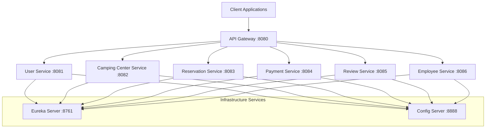
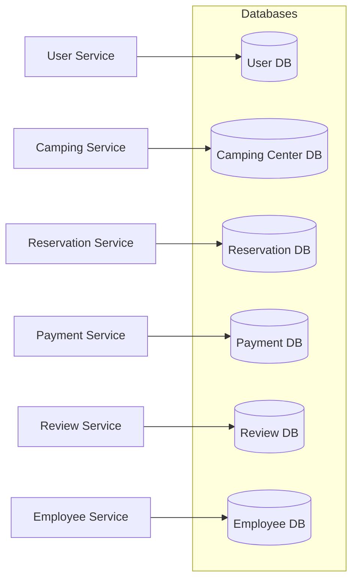
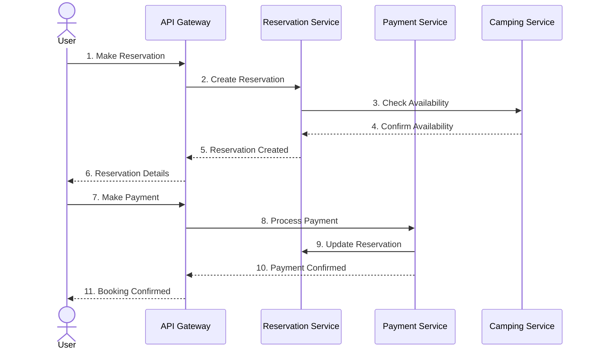

# Camping Reservation System - Microservices Architecture

## Project Overview
A microservices-based camping reservation system built with Spring Boot and Spring Cloud. This system enables users to book camping spots, manage payments, leave reviews, and interact with camping center staff.

## Architecture Overview

### System Architecture


### Database Architecture


### Reservation Flow


## Architecture Diagram
```
                                   [API Gateway :8080]
                                          │
                    ┌─────────────┬──────┴───────┬─────────────┐
                    │             │              │             │
            [User Service   [Camping Center  [Reservation  [Payment
             :8081]         Service :8082]   Service       Service
                                            :8083]         :8084]
                    │             │              │             │
                    └─────────────┴──────┬───────┴─────────────┘
                                        │
                                [Discovery Service
                                 (Eureka) :8761]
                                        │
                                [Config Server :8888]
```

## Services Overview

### Infrastructure Services

#### 1. Discovery Service (Eureka) - Port 8761
- Service registration and discovery
- Health monitoring dashboard
- URL: `http://localhost:8761`

#### 2. Config Server - Port 8888
- Centralized configuration management
- Git-based configuration storage
- URL: `http://localhost:8888`

#### 3. API Gateway - Port 8080
- Single entry point for all requests
- Load balancing and routing
- URL: `http://localhost:8080`

### Business Services

#### 4. User Service - Port 8081
```http
GET    /api/users
GET    /api/users/{id}
POST   /api/users
PUT    /api/users/{id}
```

#### 5. Camping Center Service - Port 8082
```http
GET    /api/camping-centers
GET    /api/camping-centers/{id}
POST   /api/camping-centers
PUT    /api/camping-centers/{id}
```

#### 6. Reservation Service - Port 8083
```http
GET    /api/reservations
GET    /api/reservations/{id}
POST   /api/reservations
PATCH  /api/reservations/{id}/status
```

#### 7. Payment Service - Port 8084
```http
GET    /api/payments
GET    /api/payments/{id}
POST   /api/payments
PATCH  /api/payments/{id}/status
```

#### 8. Review Service - Port 8085
```http
GET    /api/reviews
GET    /api/reviews/{id}
POST   /api/reviews
GET    /api/reviews/camping-center/{campingCenterId}
```

#### 9. Employee Service - Port 8086
```http
GET    /api/employees
GET    /api/employees/{id}
POST   /api/employees
PUT    /api/employees/{id}
GET    /api/group-leaders
POST   /api/group-leaders
```

## Technology Stack
| Technology | Version/Description |
|------------|-------------------|
| Spring Boot | 3.2.3 |
| Spring Cloud | Netflix (Eureka) |
| Database | PostgreSQL |
| Java | JDK 17 |
| Build Tool | Maven |
| API Docs | SpringDoc OpenAPI |

## Database Structure
Each service has its dedicated database:
```
├── camping_user_db
├── camping_center_db
├── camping_reservation_db
├── camping_payment_db
├── camping_review_db
└── camping_employee_db
```

## Quick Start Guide

### Prerequisites
- JDK 17
- Maven
- PostgreSQL
- Git

### Installation Steps

1. Clone the repository
```bash
git clone [https://github.com/your-username/camping-reservation-system.git](https://github.com/bilelbzeouich/StarterSpringBoot-.git)
cd camping-reservation-system
```

2. Build the project
```bash
mvn clean install
```

3. Start Services (in order)
```bash
# 1. Discovery Service
cd discovery-service && mvn spring-boot:run

# 2. Config Server
cd ../config-server && mvn spring-boot:run

# 3. API Gateway
cd ../api-gateway && mvn spring-boot:run

# 4. Business Services
cd ../user-service && mvn spring-boot:run
# Repeat for other services
```

## Monitoring & Documentation
- Eureka Dashboard: `http://localhost:8761`
- Swagger UI: `/swagger-ui.html` (available on each service)
- API Gateway Documentation: `http://localhost:8080/swagger-ui.html`

## Security Features
- Authentication via User Service
- API Gateway security layer
- Service-level validation

## Contributing
1. Fork the repository
2. Create feature branch (`git checkout -b feature/AmazingFeature`)
3. Commit changes (`git commit -m 'Add AmazingFeature'`)
4. Push to branch (`git push origin feature/AmazingFeature`)
5. Open a Pull Request

## License
MIT License - See [LICENSE](LICENSE) file


