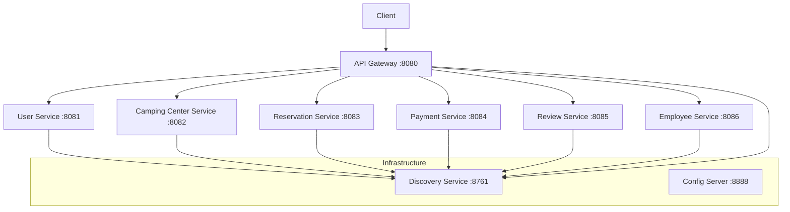
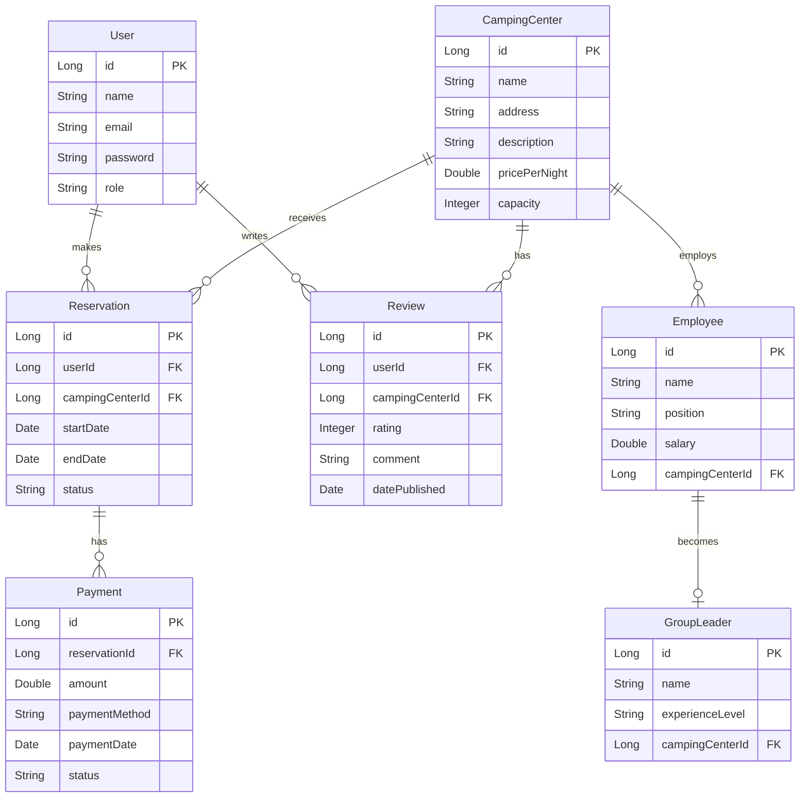
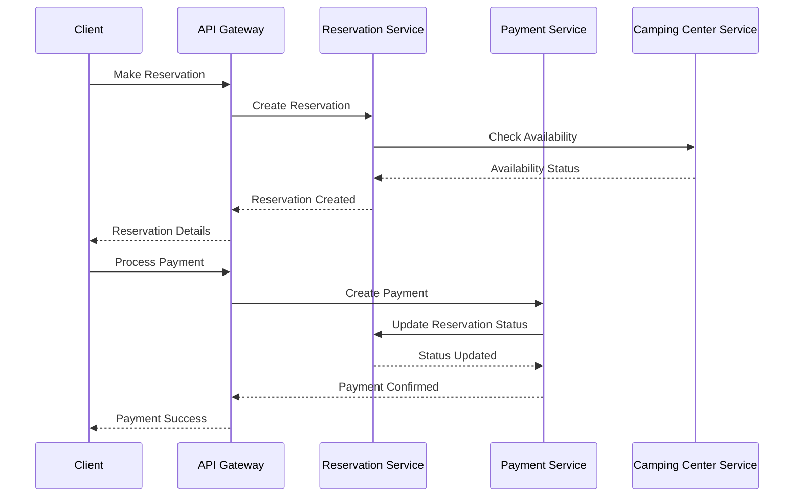

# Camping Reservation System API Documentation

## System Architecture

### Microservices Architecture


### Database Schema


### Service Communication Flow


## Base URL
```
http://localhost:8080
```

## Services

### 1. User Service (Port: 8081)
Base path: `/api/users`

#### Endpoints

##### Get All Users
```http
GET /api/users
Response: 200 OK
[
    {
        "id": 1,
        "name": "John Doe",
        "email": "john@example.com",
        "role": "USER"
    }
]
```

##### Get User by ID
```http
GET /api/users/{id}
Response: 200 OK
{
    "id": 1,
    "name": "John Doe",
    "email": "john@example.com",
    "role": "USER"
}
```

##### Create User
```http
POST /api/users
Request:
{
    "name": "John Doe",
    "email": "john@example.com",
    "password": "secret",
    "role": "USER"
}
Response: 201 Created
```

### 2. Camping Center Service (Port: 8082)
Base path: `/api/camping-centers`

#### Endpoints

##### Get All Centers
```http
GET /api/camping-centers
Response: 200 OK
[
    {
        "id": 1,
        "name": "Mountain View Camp",
        "address": "123 Mountain Rd",
        "description": "Beautiful mountain camping",
        "pricePerNight": 50.00,
        "capacity": 100
    }
]
```

##### Get Center by ID
```http
GET /api/camping-centers/{id}
Response: 200 OK
```

##### Create Center
```http
POST /api/camping-centers
Request:
{
    "name": "Mountain View Camp",
    "address": "123 Mountain Rd",
    "description": "Beautiful mountain camping",
    "pricePerNight": 50.00,
    "capacity": 100
}
Response: 201 Created
```

##### Delete Center
```http
DELETE /api/camping-centers/{id}
Response: 204 No Content
```

### 3. Reservation Service (Port: 8083)
Base path: `/api/reservations`

#### Endpoints

##### Get All Reservations
```http
GET /api/reservations
Response: 200 OK
[
    {
        "id": 1,
        "userId": 1,
        "campingCenterId": 1,
        "startDate": "2024-07-01",
        "endDate": "2024-07-05",
        "status": "PENDING"
    }
]
```

##### Create Reservation
```http
POST /api/reservations
Request:
{
    "userId": 1,
    "campingCenterId": 1,
    "startDate": "2024-07-01",
    "endDate": "2024-07-05"
}
Response: 201 Created
```

##### Update Status
```http
PATCH /api/reservations/{id}/status
Request:
{
    "status": "CONFIRMED"
}
Response: 200 OK
```

### 4. Payment Service (Port: 8084)
Base path: `/api/payments`

#### Endpoints

##### Get All Payments
```http
GET /api/payments
Response: 200 OK
[
    {
        "id": 1,
        "reservationId": 1,
        "amount": 250.00,
        "paymentMethod": "CREDIT_CARD",
        "status": "COMPLETED"
    }
]
```

##### Create Payment
```http
POST /api/payments
Request:
{
    "reservationId": 1,
    "amount": 250.00,
    "paymentMethod": "CREDIT_CARD"
}
Response: 201 Created
```

### 5. Review Service (Port: 8085)
Base path: `/api/reviews`

#### Endpoints

##### Get All Reviews
```http
GET /api/reviews
Response: 200 OK
[
    {
        "id": 1,
        "userId": 1,
        "campingCenterId": 1,
        "rating": 5,
        "comment": "Great experience!",
        "datePublished": "2024-03-15"
    }
]
```

##### Create Review
```http
POST /api/reviews
Request:
{
    "userId": 1,
    "campingCenterId": 1,
    "rating": 5,
    "comment": "Great experience!"
}
Response: 201 Created
```

##### Get Reviews by Camping Center
```http
GET /api/reviews/camping-center/{campingCenterId}
Response: 200 OK
```

### 6. Employee Service (Port: 8086)
Base path: `/api/employees` and `/api/group-leaders`

#### Employee Endpoints

##### Get All Employees
```http
GET /api/employees
Response: 200 OK
[
    {
        "id": 1,
        "name": "Jane Smith",
        "position": "GUIDE",
        "salary": 45000.00,
        "campingCenterId": 1
    }
]
```

##### Create Employee
```http
POST /api/employees
Request:
{
    "name": "Jane Smith",
    "position": "GUIDE",
    "salary": 45000.00,
    "campingCenterId": 1
}
Response: 201 Created
```

#### Group Leader Endpoints

##### Get All Group Leaders
```http
GET /api/group-leaders
Response: 200 OK
[
    {
        "id": 1,
        "name": "Mike Johnson",
        "experienceLevel": "SENIOR",
        "campingCenterId": 1
    }
]
```

##### Create Group Leader
```http
POST /api/group-leaders
Request:
{
    "name": "Mike Johnson",
    "experienceLevel": "SENIOR",
    "campingCenterId": 1
}
Response: 201 Created
```

## Error Responses

All endpoints may return the following errors:

```http
400 Bad Request
{
    "error": "Bad Request",
    "message": "Invalid input data",
    "timestamp": "2024-03-15T10:30:00Z"
}

404 Not Found
{
    "error": "Not Found",
    "message": "Resource not found",
    "timestamp": "2024-03-15T10:30:00Z"
}

500 Internal Server Error
{
    "error": "Internal Server Error",
    "message": "An unexpected error occurred",
    "timestamp": "2024-03-15T10:30:00Z"
}
```
